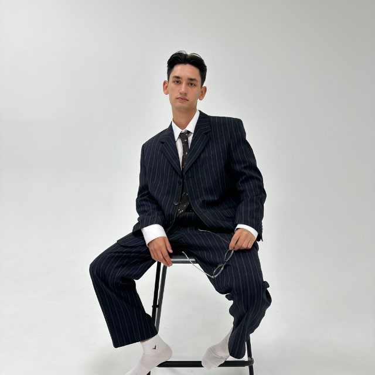

---
hide:
  - navigation
  - toc
---

ЛИЧНОЕ ДЕЛО / 01

# Даниил Степанов

Финансист. Стратег. Человек с мемами.

Работаю в Сбере, учусь в ИТМО и нахожу общий язык с людьми, цифрами и дедлайнами.

[Познакомимся :material-arrow-top-right:](about.md){ .md-button .md-button--primary }
[Я на работе :material-arrow-right:](memes.md){ .md-button }

СБЕР / ФИНАНСЫИТМО / БИЗНЕСЮМОР / 24⁄7

<figure class="portrait-frame">

<figcaption>ДАНИИЛ СТЕПАНОВPERSONAL EDITION · 2026</figcaption>
</figure>

КРАТКО ОБО МНЕ

> Гений, миллиардер, плейбой, филантроп.

А если чуть серьёзнее — классный финансист с образованием конфликтолога и интересом к высокотехнологичному бизнесу.

## Не только цифры

-   **01 / Человек за таблицами**

    Образование, работа и интересы. От конфликтологии до финансов.

    [О себе →](about.md)

-   **02 / Очень серьёзные проекты**

    Шутки и анекдоты, которые прошли внутренний аудит чувства юмора.

    [Посмотреть проекты →](projects.md)

-   **03 / Рабочее настроение**

    Пять картинок, которые объясняют рабочую неделю лучше отчёта.

    [Открыть мемы →](memes.md)

### Мой подход

1. Разобраться в задаче.
2. Найти решение и общий язык.
3. Сохранить чувство юмора.

В этом мне помогают:

- интерес к финансам и технологиям;
- опыт изучения конфликтов;
- самоирония даже в самый серьёзный понедельник.
