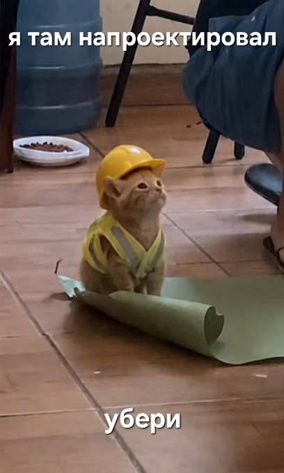
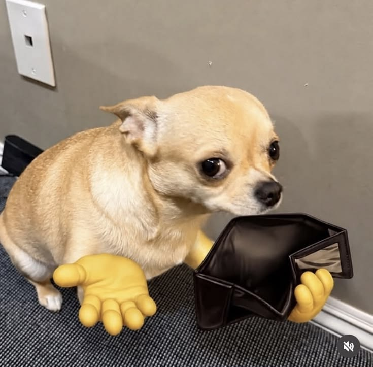
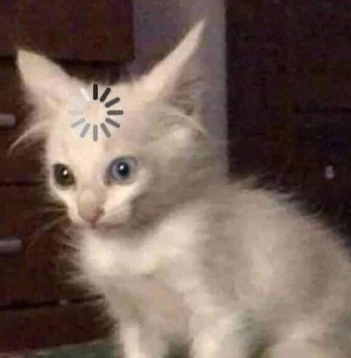
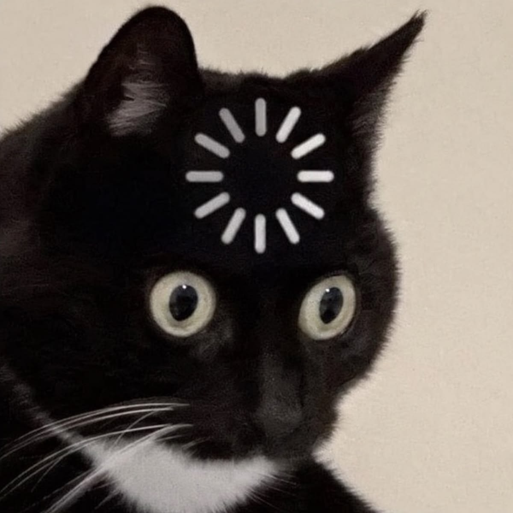
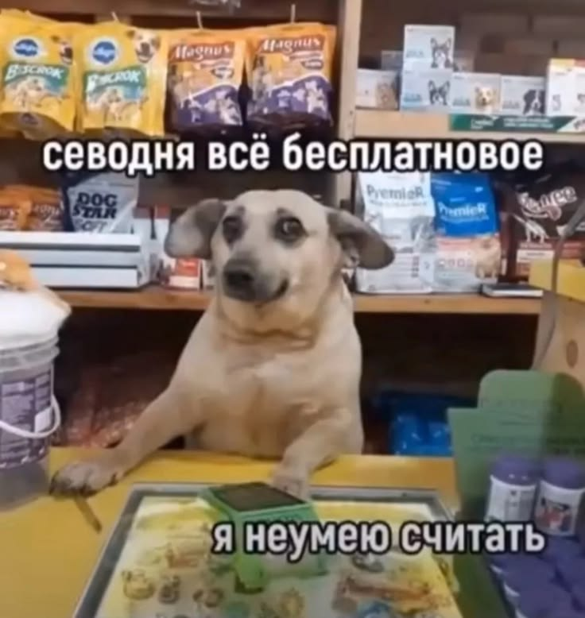

---
hide:
  - navigation
  - toc
---

ЛИЧНОЕ ДЕЛО / 04

# Я на работе

Рабочая неделя в пяти состояниях. Любые совпадения с дедлайнами неслучайны.

<figure class="meme-card">

<figcaption>01 / ПЛАНИРОВАНИЕ<h2>Я после стратегической сессии</h2>
План готов. Осталось найти того, кто его реализует.
</figcaption>
</figure>
<figure class="meme-card">

<figcaption>02 / БЮДЖЕТ<h2>Когда согласовали бюджет</h2>
Амбиции — на миллиард. Ресурсы — на печеньку.
</figcaption>
</figure>
<figure class="meme-card">

<figcaption>03 / ПОНЕДЕЛЬНИК<h2>Я на первом созвоне</h2>
Тело в офисе. Мозг ещё подключается к серверу.
</figcaption>
</figure>
<figure class="meme-card">

<figcaption>04 / ДЕДЛАЙН<h2>«Там небольшие правки»</h2>
Когда файл называется финал_точно_последний_7.
</figcaption>
</figure>
<figure class="meme-card">

<figcaption>05 / ПЯТНИЦА<h2>Финансист в 18:01</h2>
Финансовая модель перешла в режим выходных.
</figcaption>
</figure>

*Личная коллекция юмора. Подписи шуточные и не описывают работу Сбера.*
