University: [ITMO University](https://itmo.ru/ru/)

Faculty: [FICT](https://fict.itmo.ru)

Course: [Введение в веб технологии](https://ex-itmo-ict-faculty.github.io/introduction-in-web-tech/)

Year: 2026/2027

Group: U4225

Author: Степанов Даниил Сергеевич

Lab: Lab1

Date of create: 12.09.2026

Date of finished: — (заполняется после защиты)

# Лабораторная работа №1. Основы работы с Docker

## Цель работы

Освоить основные операции Docker: проверку установки, получение образов, запуск и управление контейнерами, публикацию портов и работу с томами. Создать Dockerfile для Flask-приложения по заданным требованиям, собрать образ и проверить приложение.

## Задание и результаты

Выполнены обычная часть и задание со звёздочкой. Запущен `hello-world`, в Ubuntu установлен `curl`, проверен nginx в браузере, выполнен цикл остановки, запуска и удаления контейнера. Файл в именованном томе сохранился после удаления контейнера. Собственное Flask-приложение вернуло `Hello from Docker!` с HTTP-статусом 200 и работает от пользователя с UID 1000.

## Рабочее окружение

Работа выполнена на macOS 26.6.2, архитектура компьютера — Apple Silicon. Установленный Docker Desktop запущен; клиент и сервер Docker имеют версию 29.6.1. Используется контекст `desktop-linux`, контейнеры выполняются в Linux-среде Docker Desktop, архитектура — `aarch64`.

На компьютере уже присутствовали образы, контейнеры и тома от других работ. Для текущего выполнения использованы отдельные имена с префиксом `lab1-20260912-`. Ранее созданные контейнеры и тома не удалялись. Образ приложения получил тег `my-flask-app:lab1-20260912`, чтобы сохранить существующий `my-flask-app:latest`.

Внешний порт 5000 занят процессом macOS `ControlCenter`, поэтому Flask опубликован на `127.0.0.1:5001`, а внутри контейнера, как требует задание, используется порт 5000. nginx опубликован на `127.0.0.1:8080`. Привязка к `127.0.0.1` обеспечивает доступ с этого компьютера. Имена ресурсов и внешний порт не меняют содержание выполняемых операций.

**Материалы подтверждения.** Ниже размещены 16 скриншотов с подписями. Изображения веб-страниц nginx и Flask сняты непосредственно в браузере. Остальные изображения — скриншоты браузерного просмотра фактических протоколов команд и Dockerfile. В этом представлении удалены управляющие ANSI-коды; сокращённые фрагменты явно отмечены. Полный вывод, включая ход установки пакетов, хранится в папке [logs](logs/). Скриншоты протоколов не являются снимками приложения Terminal.

## 1. Проверка установки Docker

Docker Desktop уже был установлен, поэтому повторная установка не потребовалась. После запуска Docker Desktop проверены клиент и доступность сервера:

```sh
docker --version
docker info --format 'Server={{.ServerVersion}} OS={{.OSType}} Arch={{.Architecture}}'
```

Получены версия клиента `29.6.1` и сведения о работающем сервере `Server=29.6.1 OS=linux Arch=aarch64`. В отличие от одной только команды `docker --version`, проверка сервера подтверждает готовность Docker выполнять контейнеры.

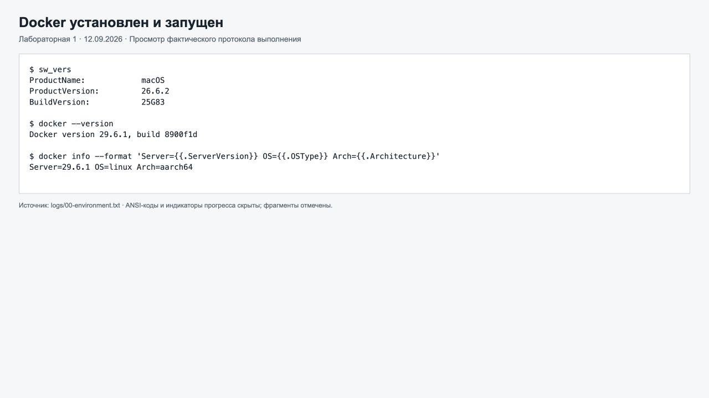

*Рисунок 1 — Версии Docker и сведения о рабочей среде.*

Запущен тестовый контейнер:

```sh
docker run --name lab1-20260912-hello hello-world
```

В выводе получено `Hello from Docker!`. Программа завершилась, поэтому её контейнер отображается в `docker ps -a` как остановленный. Это штатное поведение `hello-world`.

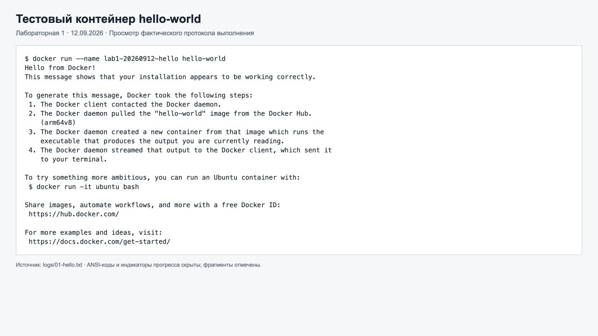

*Рисунок 2 — Успешный запуск тестового контейнера.*

Изучены базовые команды:

```sh
docker images
docker ps
docker ps -a
```

`docker images` показывает локальные образы, `docker ps` — запущенные контейнеры, а `docker ps -a` — все контейнеры, включая завершившиеся. Образ служит основой для создания контейнеров; контейнер является отдельным экземпляром с собственным состоянием и изменяемым слоем файловой системы.

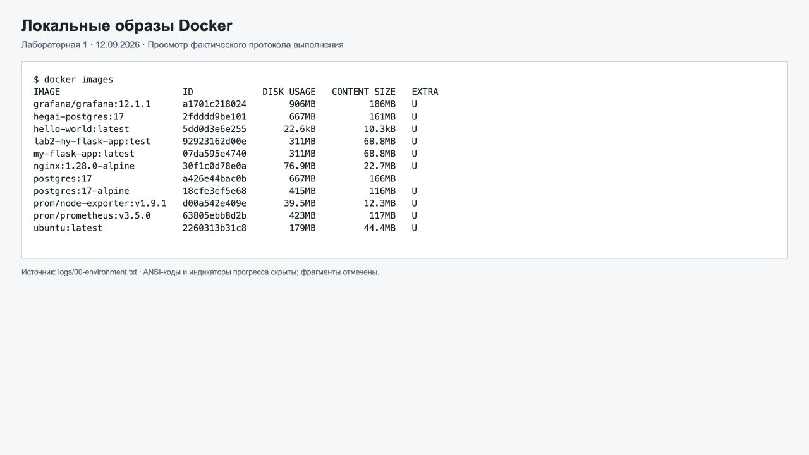

*Рисунок 3 — Локальные образы на начальном этапе работы. Часть образов существовала до выполнения этой лабораторной.*

Полный протокол: [проверка окружения](logs/00-environment.txt), [hello-world](logs/01-hello.txt).

## 2. Работа с готовым образом Ubuntu

Получен актуальный образ:

```sh
docker pull ubuntu:latest
```

Docker сообщил `Status: Downloaded newer image for ubuntu:latest`. Полученный digest:

```text
sha256:513c074113a871b51a8d16ab445c88779d6452d937a164fb5cc479f32668a41d
```

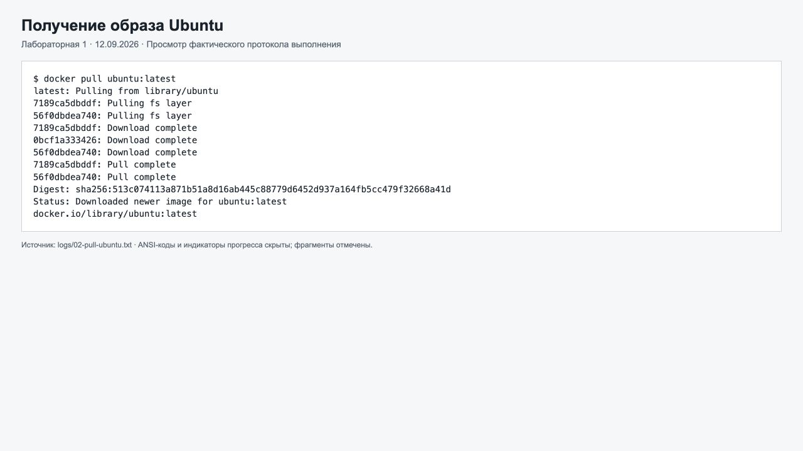

*Рисунок 4 — Загрузка слоёв и digest образа Ubuntu.*

После загрузки запущен интерактивный контейнер:

```sh
docker run -it --name lab1-20260912-ubuntu-new ubuntu bash
```

Флаг `-i` сохраняет стандартный ввод открытым, `-t` выделяет псевдотерминал. Внутри контейнера выполнено:

```sh
apt update && apt install -y curl
curl --version
exit
```

`apt update` обновляет индекс пакетов, `apt install -y curl` устанавливает пакет и автоматически подтверждает установку. Оператор `&&` запускает установку только при успешном обновлении индекса. Проверка показала `curl 8.18.0`. Команда `exit` завершила оболочку и контейнер, поскольку `bash` был его основным процессом.

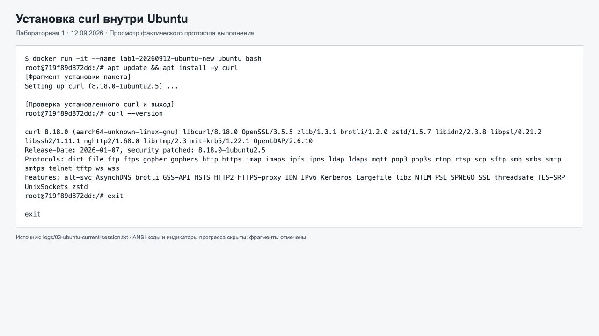

*Рисунок 5 — Установка curl внутри Ubuntu, проверка версии и выход из контейнера.*

Первичная проверка также выполнялась на ранее закэшированном Ubuntu в контейнере `lab1-20260912-ubuntu`; после завершения загрузки проверка повторена на новом образе в `lab1-20260912-ubuntu-new`. Поэтому в промежуточном списке контейнеров присутствует первоначальный запуск. Установка пакета изменяет конкретный контейнер, а не исходный образ Ubuntu.

Полные протоколы: [загрузка Ubuntu](logs/02-pull-ubuntu.txt), [интерактивная сессия после загрузки](logs/03-ubuntu-current-session.txt).

## 3. Запуск веб-сервера nginx

Запущен контейнер в фоновом режиме с публикацией порта:

```sh
docker run -d -p 127.0.0.1:8080:80 --name lab1-20260912-web nginx:alpine
```

Флаг `-d` запускает контейнер в фоне. Запись `127.0.0.1:8080:80` направляет обращения к порту 8080 компьютера на порт 80 контейнера. Отсутствующий локально образ `nginx:alpine` был автоматически загружен перед запуском.

В браузере открыт адрес `http://localhost:8080`. Отображена стандартная страница `Welcome to nginx!`.

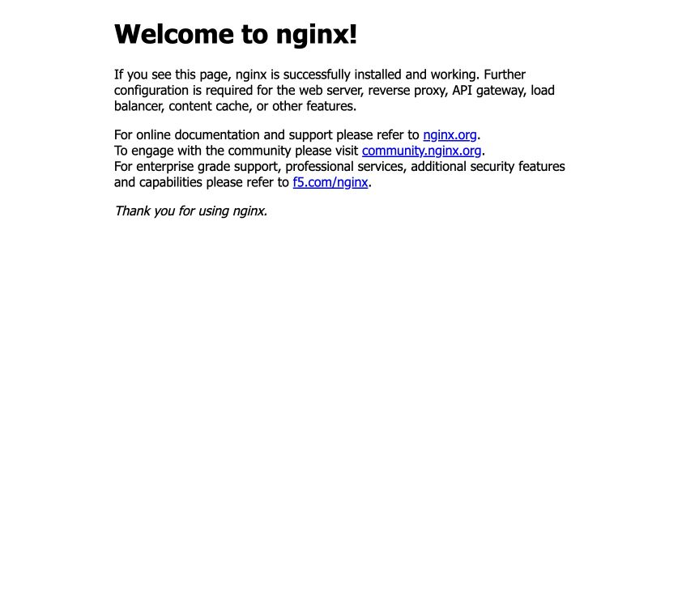

*Рисунок 6 — Работа nginx в браузере по адресу http://localhost:8080.*

Дополнительно проверены HTTP-заголовки, журнал и подключение к контейнеру:

```sh
curl -I http://localhost:8080
docker logs lab1-20260912-web
docker exec -it lab1-20260912-web sh
```

Внутри оболочки выполнено:

```sh
nginx -v
pwd
exit
```

Ответ сервера содержит `HTTP/1.1 200 OK`, установлен nginx 1.31.5. В журнале есть запись о запросе `HEAD / HTTP/1.1` со статусом 200. `docker exec` запускает дополнительный процесс внутри уже работающего контейнера; выход из такой оболочки не завершает основной процесс nginx.

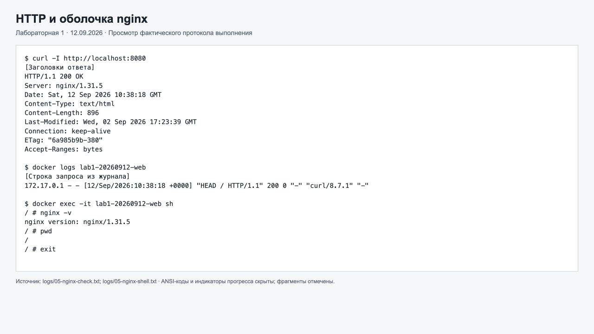

*Рисунок 7 — Проверка HTTP, журнала и интерактивной оболочки nginx.*

В полном журнале также есть ответ 404 на автоматический запрос браузера к `/favicon.ico`: файл значка отсутствует в стандартной странице. Это не мешает обслуживанию корневой страницы `/`.

Полные протоколы: [запуск nginx](logs/04-nginx-run.txt), [HTTP и журнал](logs/05-nginx-check.txt), [оболочка](logs/05-nginx-shell.txt).

## 4. Управление контейнерами

После запуска проверены активные и завершившиеся контейнеры. Для наглядности список отфильтрован по префиксу текущей работы:

```sh
docker ps --filter name=lab1-20260912
docker ps -a --filter name=lab1-20260912
```

В протоколе дополнительно использован `--format`, чтобы вывести только идентификатор, образ, состояние и имя. Фильтрация и форматирование изменяют представление списка, но не состояние контейнеров.

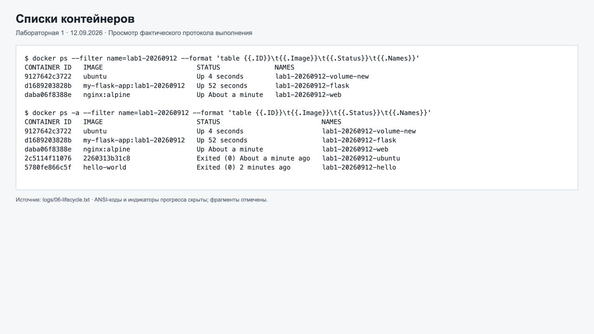

*Рисунок 8 — Различие docker ps и docker ps -a. Показано промежуточное состояние во время проверок.*

Выполнен цикл управления nginx:

```sh
docker stop lab1-20260912-web
docker inspect lab1-20260912-web --format '{{.State.Status}}'
docker start lab1-20260912-web
docker inspect lab1-20260912-web --format '{{.State.Status}}'
docker stop lab1-20260912-web
docker rm lab1-20260912-web
docker rmi nginx:alpine
```

После `stop` получено состояние `exited`, после `start` — `running`. Перед `docker rm` контейнер повторно остановлен: обычная команда удаления не удаляет работающий контейнер. Затем удалён образ `nginx:alpine`, который больше не использовался контейнерами текущей работы. Docker подтвердил операции строками `Untagged` и `Deleted`.

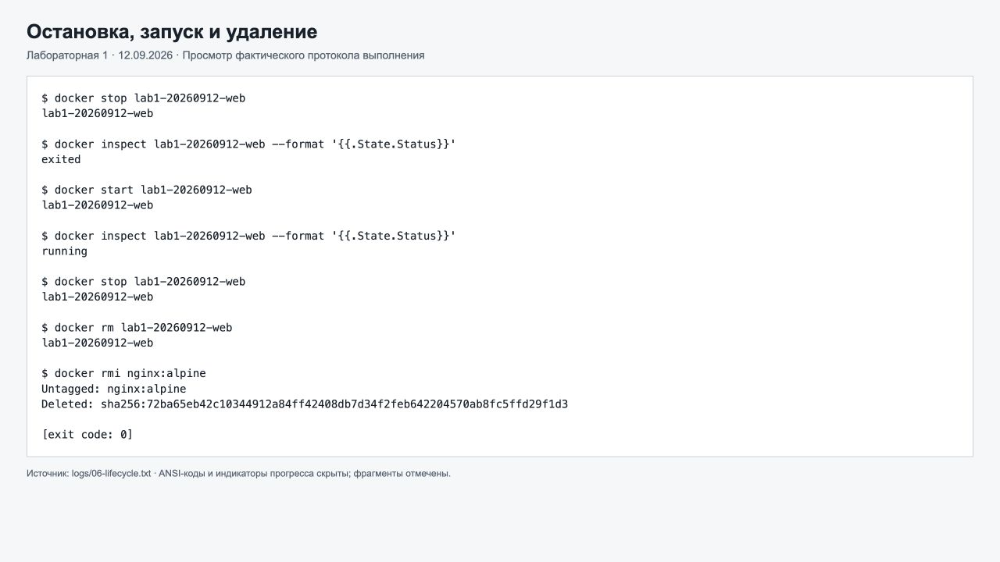

*Рисунок 9 — Остановка, повторный запуск, удаление контейнера и образа.*

`stop` сохраняет контейнер и позволяет запустить его повторно; `rm` удаляет контейнер; `rmi` удаляет образ или его тег. После этой проверки адрес nginx больше не обслуживается, что соответствует заданию на удаление.

Полный протокол: [управление контейнерами](logs/06-lifecycle.txt).

## 5. Работа с именованным томом

Создан новый том и контейнер с подключением тома к каталогу `/data`:

```sh
docker volume create lab1-20260912-volume
docker run -it --name lab1-20260912-volume-test -d \
  -v lab1-20260912-volume:/data ubuntu bash
docker exec -it lab1-20260912-volume-test bash
```

Внутри контейнера создан и прочитан файл:

```sh
echo "Hello from volume" > /data/test.txt
cat /data/test.txt
exit
```

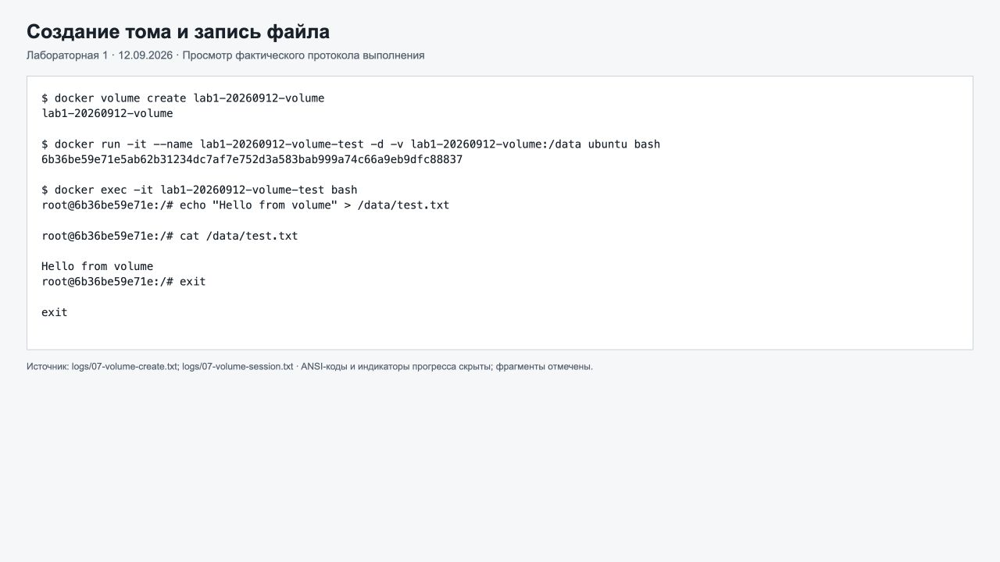

*Рисунок 10 — Создание тома, его подключение и запись файла.*

Первый контейнер остановлен и удалён. Создан другой контейнер с тем же томом:

```sh
docker stop lab1-20260912-volume-test
docker rm lab1-20260912-volume-test
docker run -it --name lab1-20260912-volume-new -d \
  -v lab1-20260912-volume:/data ubuntu bash
docker exec lab1-20260912-volume-new cat /data/test.txt
```

Результат чтения в новом контейнере:

```text
Hello from volume
```

Дополнительная проверка через `docker inspect` показала тип подключения `volume`, имя `lab1-20260912-volume` и каталог назначения `/data`.

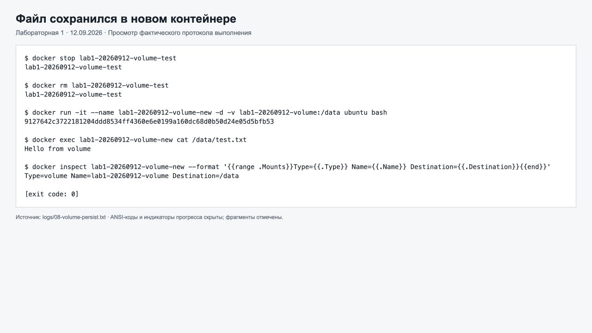

*Рисунок 11 — Тот же файл прочитан из нового контейнера после удаления предыдущего.*

Данные сохранились, потому что именованный том существует отдельно от изменяемого слоя контейнера. Удаление контейнера не удаляет этот том. После проверки новый контейнер остановлен, а том с файлом оставлен для демонстрации результата.

Полные протоколы: [создание тома](logs/07-volume-create.txt), [запись файла](logs/07-volume-session.txt), [проверка сохранности](logs/08-volume-persist.txt).

## 6. Задание со звёздочкой

### 6.1. Файлы проекта

Создан файл [app.py](app.py):

```python
from flask import Flask

app = Flask(__name__)


@app.route('/')
def hello():
    return "Hello from Docker!"


if __name__ == '__main__':
    app.run(host='0.0.0.0', port=5000)
```

Маршрут `/` возвращает заданное сообщение. Адрес `0.0.0.0` позволяет принимать запросы на сетевых интерфейсах контейнера.

Файл [requirements.txt](requirements.txt) содержит ровно заданную зависимость:

```text
Flask==2.0.1
```

### 6.2. Dockerfile

Создан [Dockerfile](Dockerfile):

```dockerfile
FROM python:3.9-slim

WORKDIR /app

RUN apt-get update \
    && apt-get install -y --no-install-recommends curl vim \
    && rm -rf /var/lib/apt/lists/*

COPY requirements.txt .
# Flask 2.0.1 requires the older Werkzeug API.
RUN pip install --no-cache-dir -r requirements.txt "Werkzeug==2.0.3"

COPY app.py .

RUN useradd --uid 1000 --create-home appuser
USER appuser

EXPOSE 5000
ENV FLASK_ENV=production

CMD ["python", "app.py"]
```

Werkzeug закреплён на версии 2.0.3 для совместимости API с Flask 2.0.1. Ограничение добавлено к команде установки, поэтому содержимое `requirements.txt` соответствует условию. Очистка индекса apt и `--no-cache-dir` исключают из образа ненужные кэши. Системные пакеты устанавливаются до перехода к непривилегированному пользователю.

В [.dockerignore](.dockerignore) разрешены только Dockerfile и два файла приложения. Отчёт, скриншоты и протоколы не передаются в контекст сборки.

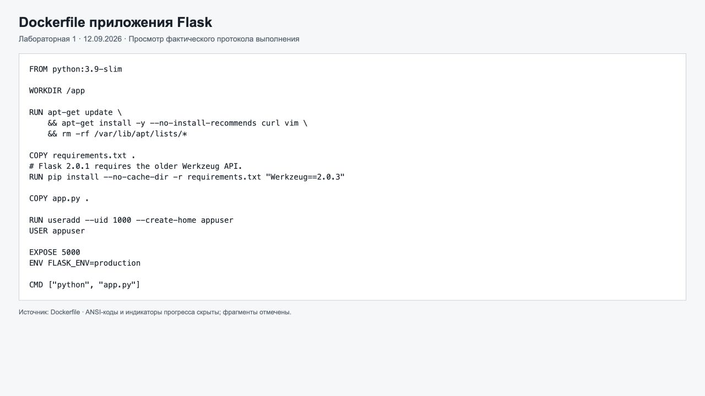

*Рисунок 12 — Dockerfile, использованный для сборки приложения.*

### 6.3. Соответствие техническим требованиям

| № | Требование | Реализация и проверка |
|---|---|---|
| 1 | Базовый образ python:3.9-slim | `FROM python:3.9-slim`; внутри установлен Python 3.9.25 |
| 2 | Рабочая директория /app | `WORKDIR /app`; команда `pwd` вернула `/app` |
| 3 | Установить curl и vim | `apt-get install`; проверены обе версии |
| 4 | Установить Python-пакеты из requirements.txt | `pip install -r requirements.txt`; Flask 2.0.1; `pip check` без ошибок |
| 5 | Скопировать app.py | `COPY app.py .`; маршрут `/` вернул заданную строку |
| 6 | Создать appuser с UID 1000 | `useradd --uid 1000 --create-home appuser`; проверен `id` |
| 7 | Переключиться на appuser | `USER appuser`; процесс проверки выполняется с `uid=1000(appuser)` |
| 8 | Открыть порт 5000 | `EXPOSE 5000`; HTTP-запрос к порту 5000 внутри контейнера успешен |
| 9 | FLASK_ENV=production | `ENV FLASK_ENV=production`; проверено через `printenv` |
| 10 | Запустить python app.py | `CMD ["python", "app.py"]`; команда подтверждена конфигурацией образа |

### 6.4. Сборка и запуск

Из корня репозитория выполнена сборка:

```sh
docker build --progress=plain -t my-flask-app:lab1-20260912 lab1
```

Та же команда из папки `lab1`:

```sh
docker build --progress=plain -t my-flask-app:lab1-20260912 .
```

Сборка завершилась успешно. В журнале присутствуют установка зависимостей, копирование приложения, создание пользователя и экспорт итогового образа.

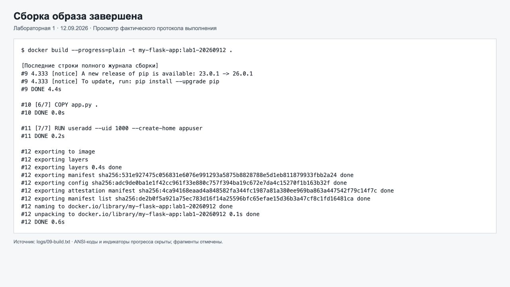

*Рисунок 13 — Завершение сборки my-flask-app:lab1-20260912.*

Запущен контейнер:

```sh
docker run -d -p 127.0.0.1:5001:5000 \
  --name lab1-20260912-flask my-flask-app:lab1-20260912
```

Первый HTTP-запрос был отправлен сразу после создания контейнера и получил `curl: (52) Empty reply from server`. После завершения запуска приложения повторный запрос успешно вернул ответ. Начальная попытка сохранена в [протоколе запуска](logs/10-flask-check.txt).

Проверка после запуска:

```sh
curl -i http://localhost:5001
docker exec lab1-20260912-flask id
docker exec lab1-20260912-flask pwd
docker exec lab1-20260912-flask printenv FLASK_ENV
docker exec lab1-20260912-flask python --version
```

Получен ответ `HTTP/1.0 200 OK`, тело — `Hello from Docker!`. Проверки также подтвердили `uid=1000(appuser)`, рабочую директорию `/app`, значение `production` и Python 3.9.25.

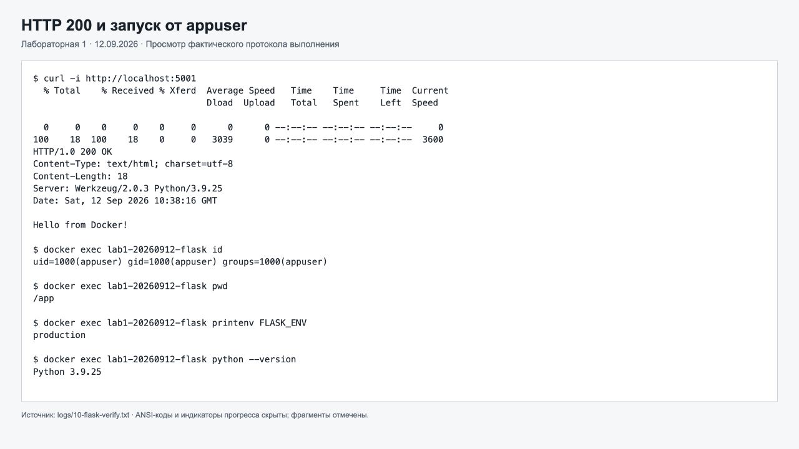

*Рисунок 14 — HTTP 200, пользователь appuser и параметры окружения.*

Проверена страница `http://localhost:5001` в браузере:


*Рисунок 15 — Сообщение Hello from Docker! в браузере.*

Дополнительно выполнены:

```sh
docker exec lab1-20260912-flask pip show Flask Werkzeug
docker exec lab1-20260912-flask sh -c 'curl --version | head -1; vim --version | head -1'
docker exec lab1-20260912-flask pip check
docker logs lab1-20260912-flask
docker exec lab1-20260912-flask curl -sS http://localhost:5000
```

Подтверждены Flask 2.0.1, Werkzeug 2.0.3, curl 8.14.1 и Vim 9.1. Команда `pip check` вернула `No broken requirements found.` Запрос из контейнера к его собственному порту 5000 также вернул `Hello from Docker!`.

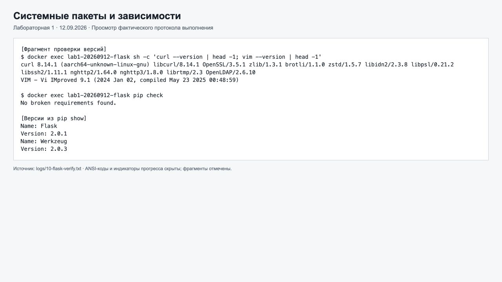

*Рисунок 16 — Системные пакеты, версии Python-зависимостей и проверка их согласованности.*

`EXPOSE` описывает используемый порт образа, но сам по себе не публикует его на компьютере: публикация выполнена флагом `-p`. Переменная `FLASK_ENV=production` установлена по условию; запуск через `python app.py` использует встроенный сервер Flask. В журнале он предупреждает, что для реального production-развёртывания нужен отдельный WSGI-сервер.

Полные протоколы: [сборка](logs/09-build.txt), [проверки Flask](logs/10-flask-verify.txt), [конфигурация образа и внутренний порт](logs/11-image-config.txt).

## 7. Итоговое состояние и повторная проверка

На момент завершения практической части Flask-контейнер работает и доступен по адресу `http://localhost:5001`. Контейнер nginx и образ `nginx:alpine` удалены по заданию. Тестовые контейнеры Ubuntu и hello-world завершены, контейнер проверки тома остановлен. Именованный том сохранён с файлом `test.txt`.

Для повторной проверки файла:

```sh
docker start lab1-20260912-volume-new
docker exec lab1-20260912-volume-new cat /data/test.txt
docker stop lab1-20260912-volume-new
```

Для повторной проверки приложения:

```sh
curl http://localhost:5001
```

Если Flask-контейнер был остановлен, сначала выполнить `docker start lab1-20260912-flask`. Для новой сборки на свободном компьютере можно использовать имя образа `my-flask-app`, контейнера `flask-container` и публикацию `-p 5000:5000` из условия. В текущем окружении используются отдельные имена и внешний порт 5001 по указанным выше причинам.

## Вывод

Освоены получение образов, создание и запуск контейнеров, просмотр списка образов и контейнеров, чтение журналов и выполнение команд через `docker exec`. На примере nginx выполнен полный цикл управления контейнером. Эксперимент с двумя контейнерами подтвердил сохранение данных в именованном томе после удаления одного из них.

Создан Dockerfile, выполняющий все десять технических требований задания со звёздочкой. Образ успешно собран, зависимости проверены, HTTP-ответ приложения получен из браузера, с компьютера и изнутри контейнера. Запуск выполняется от пользователя `appuser` с UID 1000.

Практическая часть выполнена 12.09.2026. Дата защиты не указана, поскольку поле `Date of finished` по правилам заполняется после защиты перед преподавателем.

## Источники

1. [Правила оформления отчётов](https://ex-itmo-ict-faculty.github.io/introduction-in-web-tech/education/labs2025-2026/reportdesign/) — формат Markdown, обязательная шапка, структура папок и значение даты защиты.
2. [Документация Docker](https://docs.docker.com/) — команды, образы и контейнеры.
3. [Docker Volumes](https://docs.docker.com/engine/storage/volumes/) — хранение данных независимо от жизненного цикла контейнера.
4. [Docker container rm](https://docs.docker.com/reference/cli/docker/container/rm/) — удаление контейнеров и поведение именованных томов.
5. [История изменений Flask](https://flask.palletsprojects.com/en/stable/changes/) и [Werkzeug](https://werkzeug.palletsprojects.com/en/stable/changes/) — версии и изменения API зависимостей.

Отчёт размещён в `lab1/lab1_report.md` существующего репозитория `devops-lab-stepanov`, созданного в лабораторной №0. Обязательные файлы README, .gitignore и LICENSE присутствуют. Общие правила предлагают имя репозитория по шаблону `2026_2027-introduction-in-web-tech-u4225-stepanov_d_s`; существующее имя соответствует отдельному заданию №0 и в рамках этой работы не изменялось.
